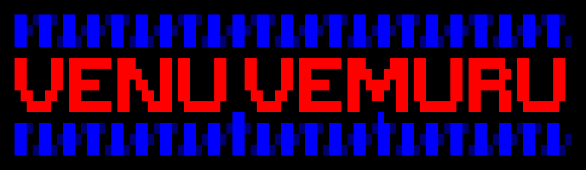

MS Computer Science, University of Georgia.

## What I am working on

- Building scheduling automation for [SER-CAT](https://sercat.franklinresearch.uga.edu), a 20+ institution synchrotron consortium at Argonne National Laboratory's Advanced Photon Source.
- Researching LLM routing and inference benchmarking.

## Tools

**Languages**

**Frameworks and runtime**

**Databases**

**Machine learning**

**Platform**

**AI tools**

## Projects

**[LLM_Comparison](https://github.com/venu284/LLM_Comparison)** &nbsp;·&nbsp; Python, PostgreSQL, Docker

**[llm-inference-benchmark](https://github.com/venu284/llm-inference-benchmark)** &nbsp;·&nbsp; PyTorch, TensorRT, CUDA
